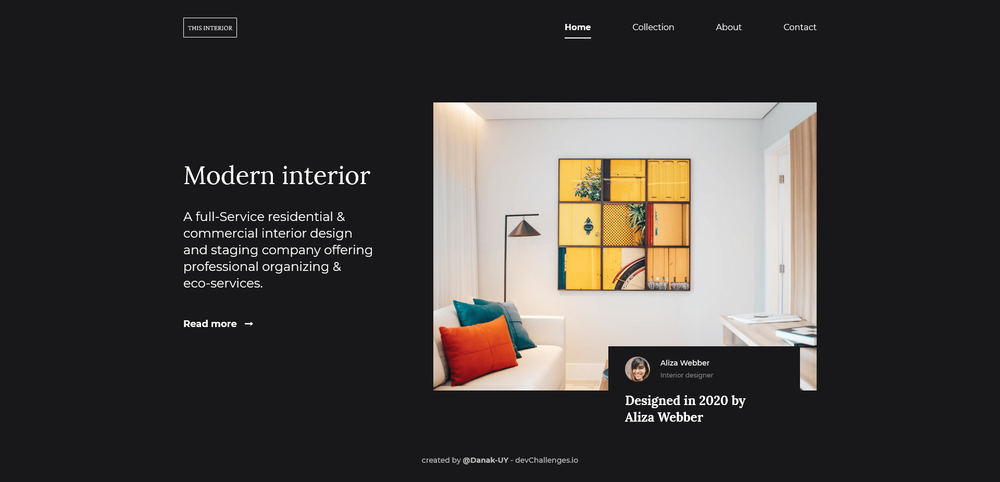

<!-- Please update value in the {}  -->

<h1 align="center">{Your project name}</h1>

   Solution for a challenge from  <a href="http://devchallenges.io" target="_blank">Devchallenges.io</a>.

  <h3>
    <a href="http://dk-interior-consultant.surge.sh/">
      Demo
    </a>
     | 
    <a href="https://github.com/Danak-UY/interior-consultant">
      Solution
    </a>
     | 
    <a href="https://devchallenges.io/challenges/Jymh2b2FyebRTUljkNcb">
      Challenge
    </a>
  </h3>

<!-- TABLE OF CONTENTS -->

## Table of Contents

- [Overview](#overview)
  - [Built With](#built-with)
- [Features](#features)
- [Contact](#contact)
- [Acknowledgements](#acknowledgements)

<!-- OVERVIEW -->

## Overview

### Built With

<!-- This section should list any major frameworks that you built your project using. Here are a few examples.-->

- [TailwindCSS](https://tailwindcss.com/) - CSS Styling
- [Material Icons](https://developers.google.com/fonts/docs/material_icons) - Menu Icons

## Features

<!-- List the features of your application or follow the template. Don't share the figma file here :) -->

This application/site was created as a submission to a [DevChallenges](https://devchallenges.io/challenges) challenge. The [challenge](https://devchallenges.io/challenges/Jymh2b2FyebRTUljkNcb) was to build an application to complete the given user stories.

## Acknowledgements

<!-- This section should list any articles or add-ons/plugins that helps you to complete the project. This is optional but it will help you in the future. For exmpale -->

- [Tailwind Animate](https://github.com/jamiebuilds/tailwindcss-animate) - Useful animations

## User Stories

- I can see a page following the given design
- On mobile, I can see a collapsed navigation
- On mobile, when I select the hamburger menu, I can see a navigation
